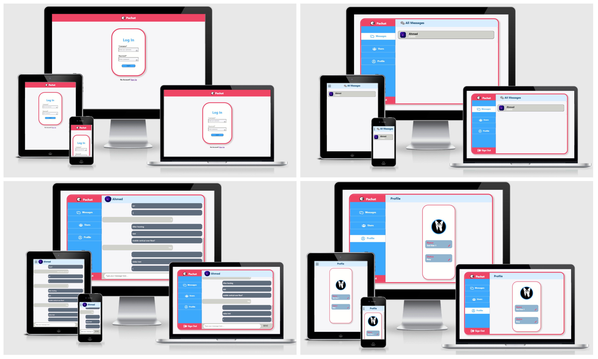

# Pachat
---

A Real-Time Chat App written with GraphQL, AWS AppSync, AWS Amplify, React, & Redux

## Built With:
- AWS AppSync
- AWS Amplify
- GraphQL
- Redux
- React
- HTML
- Sass
- JavaScript

## Using the Application:
1. Install dependencies: `npm install`
2. Initialize amplify: `amplify init`
3. Run project: `npm start`
